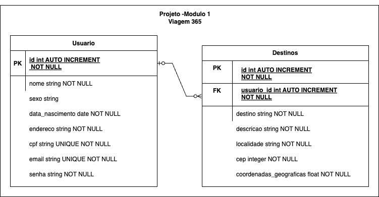

# 🚀 Não faça sua viagem sem antes utilizar a plataforma Viagem365

  O Viagem365 é uma plataforma que visa promover viagens sustentáveis e experiências positivas para os usuários, fornecendo acesso a informações sobre destinos turísticos, praias, atrações naturais e atividades recreativas os quais os usuários poderão cadastra-los em cada viagens que fizerem. Também podem explorar e descobrir novos destinos, encontrar dicas de viagem sustentável com as experiências de outros viajantes. As funcionalidades incluem o cadastro de novos usuários, listagem, edição e deleção de destinos, visualização de informações dos destinos, entre outras. 
  
## 🏦 Módulo 1 - Projeto Avaliativo

Este repositório se baseia em um projeto avaliativo do curso FuturoDev o qual faço parte da turma TRIP com entrega no dia 17/05/2024 encerrando o primeiro módulo.
Seguindo um roteiro e aplicando as regras de negócio e rotas que devem ser criadas na aplicação com todas as regras de entrega do projeto avaliativo.

**Objetivo: Montagem e execução de uma aplicação Back-End, que deverá ser uma API Rest, codificada com uso do Node, Express e PostgreSQL - Software MVP**

A API Viagem365 deseja automatizar algumas ações de atendimento, criando um sistema para armazenamento de informações do usuário(s) e seus destino(s) que poderá servir para gerar um aplicativo que demonstra os pontos de interesses dos usuários para coletar dados, gerar marketing pra empresas de turismo, engajamento em rotas desconhecidas e melhorias de conservação da natureza local...

  *Bora usar as boas praticas de desenvolvimento de software!*

## 📉 Diagrama relacional

<p>
  
</p>

## 🤖 Como rodar o repositório:

Clone o repositório em sua máquina em uma pasta local 

`Git clone https://github.com/pricbnll/viagem365.git`

## Se necessário rodar as migrations:

Se não houverem tabelas em seu Banco de Dados, rodar as migrations para gerá-los.

`sequelize db:migrate`

## 🌱 SEEDERS

Para ter valores inciais no banco de dados será necessário rodar o comando abaixo

PRIMEIRO:
`sequelize-cli db:seed --seed usuario.seeders.js`
SEGUNDO:
`sequelize-cli db:seed --seed destino.seeders.js`


## 🤖 Como rodar o Swagger:

Pelo terminal passa o comando: `node ./swagger.js` 

Pelo browser:
[link] (http://localhost:3365/docs)


### Sempre que precisas rodar o repositório em ambiente local

`npm run start:dev`


### ≈IMPORTANTE!!!!! Na primeira vez é necessário instalar as dependências:

1. `npm install`
2. Se for em ambiente local: `npm install --dev`
3. `cp .env_example .env`

## Instale as bibliotecas utilizadas:

### instalar o sequelize

`npm install sequelize`

### instalar o driver do PostgreSQL

`npm install pg`

### instalar o CLI do sequelize nas devDependencies

`npm install sequelize-cli --save-dev`

### instalar o dotenv

`npm install dotenv`

### instalar o JsonWebToken ( JWT )

`npm install jsonwebtoken`

### instalar o Nodemon nas devDependencies

`npm install nodemon --save-dev`

### instalar o Swagger UI

`npm install swagger-ui-express`

### instalar o Swagger AutoGen para gerar o documento Swagger de forma automática.

`npm install swagger-autogen`


## 📂 PARA ACESSAR A DOCUMENTAÇÃO ACESSE O LINK:

Caso tenha alguma dúvida!!

[SEQUELIZE](https://sequelize.org/docs/v6/core-concepts/model-basics/)

[SWAGGER Autogen](https://swagger-autogen.github.io/docs/)

### 📝 Preencher o .env com seus dados
```
DIALECT=postgres 
HOST=localhost
USERNAMEDB=postgres #Qual o username da sua DataBase? Exemplo
PASSWORDDB=postgres 'Qual a senha do seu DataBase? Exemplo
DATABASE=viagem365 #Qual o nome da DataBase? Exemplo
PORT=5432
PORT_API=3365 #Qual a porta do seu servidor escolhido? Exemplo
SECRET_JWT=viagem365 #Qual a senha secreta para gerar o JWT? Exemplo
```

## 🔪 Validações importantes

- Token JWT - criado na rota login (email e senha do usuário) utilizado para autenticação das rotas privadas. Obs: Token sem tempo de expiração.
  
- Tabela usuário:
  Impor o preenchimento do nome, sexo, data_nascimento, endereco, cpf, email, senha
  CPF e email ão único - não podem repetir nas colunas respectivas
  A data de nascimento no formato correto-ANO-MÊS=DIA
  Um CPF válido com 11 dígitos, não todos iguais e função retirada da Recita Federal (validarCPF)

- Tabela destinos:
  Nas rotas o id é extraído do seu token (feito no login)
  Cep é inserido e através dele extraído as coordenadas geograficas pela API externa (https://docs.awesomeapi.com.br/api-cep) e colocada no banco de dados daquele destino.
  Somente o usuário daquele destino pode atualizar ou deletar seu(s) destino (s) cadastrado(s).
  
## 🛠️ Construído com

- Trello - todos os passos que fiz para criar, roteiro da aplicação, regras de negócios e validações exigidas
- VsCode - para formar o código em Node.js
- GitHub - utilizando o GitFlow, criado a main, develop e algumas branches para desenvolver cada passo exigido (rotas, controllers, seeders, swagger, API externa para obter coordenadas geográficas a partir do CEP informado...)
- Node.js 
- Express - para execução do javascript como linguagem de back-end.
- Sequelize - usado na formulação da migration, models, controllers, routes...
- Postgres - utilizado como Banco de dados.
- Postman - Utilizado para criar, compartilhar, testar e documentar APIs
- JWT - utilizado para geração do token que utilizaremos nas autenticação das rotas privadas
- Swagger - criar manualmente a documentação da API
- Seeds - usadas para popular automaticamente o banco de dados com dados de teste ou dados iniciais

  

## 🧑🏻‍🏫 Professores para auxilio

* **Rawan.H** - [GitHub](https://github.com/Hawangledt)
* **Douglas Cavalcante** - [GitHub](https://github.com/douglas-cavalcante)


## 👀 Melhorias

- Outros usuários fazer comentário nos destinos de outros usuários.
- Aprender a utilizar o npm e seus validators (npm i cpf-cnpj-validator -S)
- Dar um tempo de expiração ao token, por exemplo de 24 horas ou até a troca do dia.
- Melhorar o Gitflow. Cada branch da develop deve ser somente sobre o tema que ela propões.
- Fazer YUP


## 🎁 Expressões de gratidão

* O Floripa Mais Tec é uma iniciativa da Prefeitura de Florianópolis, em parceria com SENAI/SC, SEBRAE e ACATE, que visa democratizar o acesso ao ensino tecnológico para todos, oferecendo cursos de Tecnologia gratuitos!  📢;
* Lab365 e todos os monitores;
* Aos melhores colegas de classe de TRIP e NATURE que alguém poderia ter! 
* Qualquer dúvida ou sugestão de melhorar o código eu aceito - algumas escrevi acima!!!


## 	📹 Video de apresentação do MiniProjeto 1

[Video] - ()
